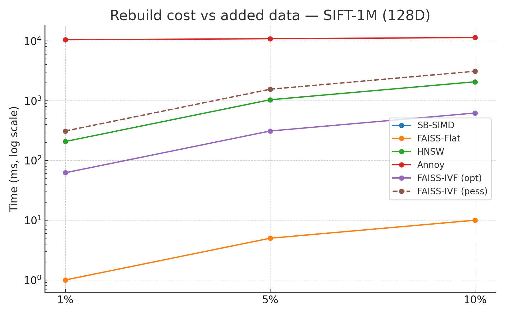

# SB-SIMD Semantic ENN Search Engine 
### *A stateless semantic Exact NN engine for dynamic subsets.*

Perfect for workloads where every query might apply heavy filters, producing unique subsets, or even stream-like data that changes every second. ANN indexes struggle here, but SB-SIMD stateless ENN can simply rebuild on the fly. Eg. ideal for streams, RAG environments, complex website filters.


----

I have a pet project where I’ve been struggling a lot with one particular challenge: *semantic dynamic search*.
The essence of similarity search is that it doesn’t look for exact matches, but for the closest results.

For example, if a user types “I love white sneakers”, the engine doesn’t just look for the exact keyword “white sneaker”, but understands semantic similarity. It can also return products described as “beloved white sneaker” by others, or where the description only says “casual sneaker white”.

Now, think about how many options this opens up in an e-commerce webshop. *In my case, perhaps even more — since the data can also come dynamically through graphs.*

Result is  0.5 - 5 ms overhead per query vs no index time.

👉 What you see here is the solution I’ve built for this pet project. 

----

<br>
Perhaps you’ve already encountered the **HNSW filtering problem**.  
HNSW is extremely fast for large static datasets, but as soon as you apply **dynamic filters** (e.g. `WHERE user_id=...` or `category=...`), performance degrades dramatically:

- The index is built globally, not per-filter.  
- When you restrict to a subset, the graph connectivity is no longer optimal.  
- The engine often ends up scanning far more nodes than expected, so query latency can jump from **<1 ms → 20–100 ms**.  
- Workarounds (pre-building per-filter indexes, or post-filtering results) are either memory-intensive or increase latency further.  

Why this matters

This is why **HNSW works great for global, static similarity search**,  
but it’s not ideal for **highly dynamic, filter-heavy workloads**.

By contrast, a **stateless ENN (Exact Nearest Neighbor) engine**, implemented here in **Clojure**, can rebuild on the fly for each filtered subset. Overload max 0,5ms - 5ms in normal cases. 

That makes it practical for use cases with:
- rapidly changing datasets,  
- stream-like data,  
- or queries that always narrow the search space dynamically.  

## ✅ Best fit use cases

- **Small / medium subsets**  (< 100k, max. 700ms ~ 1Mx768D)

  When user queries always filter down the space to 1k–10k vectors, the rebuild + search fits easily within low latency budgets.  
<br>

- **Extreme filtering / rapidly changing custom subsets** 

  Perfect for workloads where every query might apply heavy filters, producing unique subsets, or even stream-like data that changes every second.  
  (ANN indexes struggle here, but a stateless ENN can simply rebuild on the fly.)

<br>

- **Ephemeral / ad-hoc searches**

  Ideal for real-time logs, sensor data, or session-based datasets where the relevant subset changes constantly and indexing on-the-fly is more efficient.  
<br>

- **Edge / mobile / microservices**

  Lightweight in-memory search when Postgres, Milvus, or Qdrant are too heavy.  
<br>

- **Rapid prototyping / experimentation**

  When you need quick iteration without maintaining a persistent index.

<br>


---

## ⚠️ Less suitable

- **Very large, stable datasets**  

  Millions of vectors (> 1M), where persistent ANN engines dominate with <10 ms query times.  
<br>

- **Database-first environments**  

  When transactional guarantees, SQL integration, or auditability are required.

<br>

- **Not a competitor to pgvector or Milvus, but rather a niche complement:**

  “A stateless ENN engine for dynamic subsets.”  
<br>  

## Performance

### Scaling Performance


### Rebuild Cost Comparison


### Benchmark Results

With SimSIMD Native Library on Apple M-series (10 threads):

| Dataset | Vectors | Dimensions | Search Time | QPS |
|---------|---------|------------|-------------|-----|
| SIFT | 10K | 128 | 0.99ms | 829 |
| SIFT | 100K | 128 | 3.90ms | 210 |
| SIFT | 1M | 128 | 38.83ms | 23 |
| BERT | 10K | 768 | 0.95ms | 564 |
| BERT | 100K | 768 | 9.88ms | 98 |
| OpenAI | 10K | 1536 | 1.33ms | 729 |
| OpenAI | 100K | 1536 | 13.62ms | 72 |
| Bible | 31K | 768 | 2.83ms | 345 |

## Installation

### Prerequisites

1. Java 11+
2. Clojure CLI tools

### Setup

```bash
# Clone the repository
git clone https://github.com/yourusername/sb-simd.git
cd sb-simd
```

## Usage

### Quick Start

```bash
# Run benchmarks
java -cp "classes:simsimd.jar:$(clojure -Spath)" clojure.main -m sb-simd.benchmark

# Run specific test
java -cp "classes:simsimd.jar:$(clojure -Spath)" clojure.main -m sb-simd.benchmark SIFT-100K
```

### As a Library

```clojure
(require '[sb-simd.core :as simd])

;; Load embeddings
(def index (simd/create-index "data/embeddings.json"))

;; Search
(def results (simd/search {:embeddings (:embeddings index)
                           :query query-vector
                           :k 10
                           :dimension 768}))

;; Results include similarity scores and indices
(:results results) ; => [[0.95 123] [0.94 456] ...]
(:time-ms results) ; => 3.14
(:qps results)     ; => 318
```

## Data Format

Embeddings should be in JSON format:

```json
[
  {
    "id": "item1",
    "text": "Example text",
    "embedding": [0.1, 0.2, ...]
  },
  ...
]
```

Or with metadata:

```json
{
  "metadata": {...},
  "verses": [
    {
      "id": "item1",
      "text": "Example text",
      "embedding": [0.1, 0.2, ...]
    }
  ]
}
```

## Architecture

SB-SIMD uses a brute-force approach with several optimizations:

1. **SIMD Operations** - Hardware-accelerated cosine similarity via SimSIMD
2. **Parallel Search** - Dataset split across threads for concurrent processing
3. **Heap-based Top-K** - Efficient tracking of best matches
4. **Zero-copy Arrays** - Direct memory operations on float arrays


## Comparison with Other Methods

| Method | Build Time | Search@100K | Recall | Update |
|--------|------------|-------------|--------|--------|
| SB-SIMD | 0ms | 3.9ms | 100% | Instant |
| FAISS-Flat | 100ms | 7.7ms | 100% | Rebuild |
| HNSW | 8.3s | 0.15ms | 99% | Incremental |
| Annoy | 611ms | 0.05ms | 95% | Rebuild |

## Examples

See the `examples/` directory for benchmark scripts:

```bash
cd examples
./run-all.sh    # Run all benchmarks
./run-sift.sh   # SIFT dimension tests
./run-bert.sh   # BERT dimension tests
```

## Native Libraries

The project includes pre-compiled native libraries for macOS ARM64:
- `libsimsimd.dylib` - SimSIMD core library
- `libsimsimdjni.dylib` - JNI wrapper

For other platforms, the system falls back to pure Java implementation (slower but functional).


---

## BERT-10K (768D)

| Method     |   Build (ms) | Rebuild 1%   | Rebuild 5%   | Rebuild 10%   |   Search P50 (ms) | Recall   | Total (10%+Search)   |
|:-----------|-------------:|:-------------|:-------------|:--------------|------------------:|:---------|:---------------------|
| SB-SIMD    |          0   | 0.0          | 0.0          | 0.0           |             0.756 | 100%     | 0.76                 |
| FAISS-Flat |          2.4 | 0.02         | 0.12         | 0.24          |             0.44  | 100%     | 0.68                 |
| HNSW       |       2100   | 21.0         | 105.0        | 210.0         |             0.35  | ~99%     | 210.35               |
| Annoy      |        350   | 353.5        | 367.5        | 385.0         |             0.02  | ~95%     | 385.02               |
| FAISS-IVF  |        115   | 1.15–5.75    | 5.75–28.75   | 11.50–57.50   |             0.08  | ~98%     | 11.58–57.58          |

---


---


---

## BERT-100K (768D)

| Method     |   Build (ms) | Rebuild 1%   | Rebuild 5%   | Rebuild 10%   |   Search P50 (ms) | Recall   | Total (10%+Search)   |
|:-----------|-------------:|:-------------|:-------------|:--------------|------------------:|:---------|:---------------------|
| SB-SIMD    |          0   | 0.0          | 0.0          | 0.0           |             7.088 | 100%     | 7.09                 |
| FAISS-Flat |         39.4 | 0.39         | 1.97         | 3.94          |             5.05  | 100%     | 8.99                 |
| HNSW       |      48000   | 480.0        | 2400.0       | 4800.0        |             0.9   | 99%      | 4800.9               |
| Annoy      |       3600   | 3636.0       | 3780.0       | 3960.0        |             0.05  | 95%      | 3960.05              |
| FAISS-IVF  |       1500   | 15.00–75.00  | 75.00–375.00 | 150.00–750.00 |             0.55  | 98%      | 150.55–750.55        |

---


---


---

## BERT-1M (768D)

| Method     |   Build (ms) |   Rebuild 1% |   Rebuild 5% |   Rebuild 10% |   Search P50 (ms) | Recall   |   Total (10%+Search) |
|:-----------|-------------:|-------------:|-------------:|--------------:|------------------:|:---------|---------------------:|
| FAISS-Flat |        372.9 |         3.73 |        18.64 |         37.29 |             51.33 | 100%     |                88.62 |

---


---


---

## OpenAI-10K (1536D)

| Method     |   Build (ms) | Rebuild 1%   | Rebuild 5%   | Rebuild 10%   |   Search P50 (ms) | Recall   | Total (10%+Search)   |
|:-----------|-------------:|:-------------|:-------------|:--------------|------------------:|:---------|:---------------------|
| SB-SIMD    |            0 | 0.0          | 0.0          | 0.0           |             1.167 | 100%     | 1.17                 |
| FAISS-Flat |            4 | 0.04         | 0.2          | 0.4           |             0.89  | 100%     | 1.29                 |
| HNSW       |         4200 | 42.0         | 210.0        | 420.0         |             0.7   | 99%      | 420.7                |
| Annoy      |          700 | 707.0        | 735.0        | 770.0         |             0.04  | 95%      | 770.04               |
| FAISS-IVF  |          230 | 2.30–11.50   | 11.50–57.50  | 23.00–115.00  |             0.16  | 98%      | 23.16–115.16         |

---


---


---

## OpenAI-100K (1536D)

| Method     |   Build (ms) | Rebuild 1%   | Rebuild 5%    | Rebuild 10%    |   Search P50 (ms) | Recall   | Total (10%+Search)   |
|:-----------|-------------:|:-------------|:--------------|:---------------|------------------:|:---------|:---------------------|
| SB-SIMD    |          0   | 0.0          | 0.0           | 0.0            |             12.24 | 100%     | 12.24                |
| FAISS-Flat |         75.7 | 0.76         | 3.79          | 7.57           |              9.39 | 100%     | 16.96                |
| HNSW       |      96000   | 960.0        | 4800.0        | 9600.0         |              1.8  | 99%      | 9601.8               |
| Annoy      |       7200   | 7272.0       | 7560.0        | 7920.0         |              0.1  | 95%      | 7920.1               |
| FAISS-IVF  |       3000   | 30.00–150.00 | 150.00–750.00 | 300.00–1500.00 |              1.1  | 98%      | 301.10–1501.10       |

---


---


---

## SIFT-10K (128D)

| Method     |   Build (ms) | Rebuild 1%   | Rebuild 5%   | Rebuild 10%   |   Search P50 (ms) | Recall   | Total (10%+Search)   |
|:-----------|-------------:|:-------------|:-------------|:--------------|------------------:|:---------|:---------------------|
| SB-SIMD    |          0   | 0.0          | 0.0          | 0.0           |             0.535 | 100%     | 0.54                 |
| FAISS-Flat |          0.9 | 0.01         | 0.05         | 0.09          |             0.11  | 100%     | 0.2                  |
| HNSW       |        359   | 3.59         | 17.95        | 35.9          |             0.06  | ~99%     | 35.96                |
| Annoy      |         58.5 | 59.09        | 61.43        | 64.35         |             0.01  | ~95%     | 64.36                |
| FAISS-IVF  |         19.3 | 0.19–0.97    | 0.97–4.83    | 1.93–9.65     |             0.01  | ~98%     | 1.94–9.66            |

---


---


---

## SIFT-100K (128D)

| Method     |   Build (ms) | Rebuild 1%   | Rebuild 5%   | Rebuild 10%   |   Search P50 (ms) | Recall   | Total (10%+Search)   |
|:-----------|-------------:|:-------------|:-------------|:--------------|------------------:|:---------|:---------------------|
| SB-SIMD    |          0   | 0.0          | 0.0          | 0.0           |              3.52 | 100%     | 3.52                 |
| FAISS-Flat |          4.3 | 0.04         | 0.21         | 0.43          |              0.77 | 100%     | 1.2                  |
| HNSW       |       8270.2 | 82.7         | 413.51       | 827.02        |              0.15 | ~99%     | 827.17               |
| Annoy      |        611   | 617.11       | 641.55       | 672.1         |              0.01 | ~95%     | 672.11               |
| FAISS-IVF  |        249.9 | 2.50–12.50   | 12.50–62.48  | 24.99–124.95  |              0.09 | ~98%     | 25.08–125.04         |

---


---


---

## SIFT-1M (128D)

| Method     |   Build (ms) | Rebuild 1%   | Rebuild 5%     | Rebuild 10%    |   Search P50 (ms) | Recall   | Total (10%+Search)   |
|:-----------|-------------:|:-------------|:---------------|:---------------|------------------:|:---------|:---------------------|
| SB-SIMD    |          0   | 0.0          | 0.0            | 0.0            |            28.539 | 100%     | 28.54                |
| FAISS-Flat |         99.9 | 1.0          | 5.0            | 9.99           |             7.72  | 100%     | 17.71                |
| HNSW       |      20742   | 207.42       | 1037.1         | 2074.2         |             2.89  | ~99%     | 2077.09              |
| Annoy      |      10371   | 10474.71     | 10889.55       | 11408.1        |             5.78  | ~95%     | 11413.88             |
| FAISS-IVF  |       6223   | 62.23–311.15 | 311.15–1555.75 | 622.30–3111.50 |             3.61  | ~98%     | 625.91–3115.11       |

---




---


---

## GloVe-100K (100D)

| Method     |   Build (ms) | Rebuild 1%   | Rebuild 5%   | Rebuild 10%   |   Search P50 (ms) | Recall   | Total (10%+Search)   |
|:-----------|-------------:|:-------------|:-------------|:--------------|------------------:|:---------|:---------------------|
| SB-SIMD    |          0   | 0.0          | 0.0          | 0.0           |             2.997 | 100%     | 3.0                  |
| FAISS-Flat |          2.7 | 0.03         | 0.14         | 0.27          |             0.64  | 100%     | 0.91                 |
| HNSW       |       7581.4 | 75.81        | 379.07       | 758.14        |             0.13  | ~99%     | 758.27               |
| Annoy      |        541.9 | 547.32       | 569.0        | 596.09        |             0.01  | ~95%     | 596.1                |
| FAISS-IVF  |        254.9 | 2.55–12.75   | 12.75–63.73  | 25.49–127.45  |             0.07  | ~98%     | 25.56–127.52         |

---


---


---

## Fashion-MNIST (60K × 784D)

| Method     |   Build (ms) | Rebuild 1%   | Rebuild 5%   | Rebuild 10%   |   Search P50 (ms) | Recall   | Total (10%+Search)   |
|:-----------|-------------:|:-------------|:-------------|:--------------|------------------:|:---------|:---------------------|
| SB-SIMD    |          0   | 0.0          | 0.0          | 0.0           |             3.052 | 100%     | 3.05                 |
| FAISS-Flat |         24.2 | 0.24         | 1.21         | 2.42          |             2.85  | 100%     | 5.27                 |
| HNSW       |      31180   | 311.8        | 1559.0       | 3118.0        |             0.73  | ~99%     | 3118.73              |
| Annoy      |       2085.5 | 2106.36      | 2189.78      | 2294.05       |             0.03  | ~95%     | 2294.08              |
| FAISS-IVF  |        374.3 | 3.74–18.71   | 18.71–93.58  | 37.43–187.15  |             0.38  | ~98%     | 37.81–187.53         |

---


---


---

## Bible-31K (768D)

| Method     |   Build (ms) | Rebuild 1%   | Rebuild 5%   | Rebuild 10%   |   Search P50 (ms) | Recall   | Total (10%+Search)   |
|:-----------|-------------:|:-------------|:-------------|:--------------|------------------:|:---------|:---------------------|
| SB-SIMD    |            0 | 0.0          | 0.0          | 0.0           |             1.593 | 100%     | 1.59                 |
| FAISS-Flat |           15 | 0.15         | 0.75         | 1.5           |             2.5   | 100%     | 4.0                  |
| HNSW       |        15000 | 150.0        | 750.0        | 1500.0        |             0.5   | ~99%     | 1500.5               |
| Annoy      |         1000 | 1010.0       | 1050.0       | 1100.0        |             0.02  | ~95%     | 1100.02              |
| FAISS-IVF  |          200 | 2.00–10.00   | 10.00–50.00  | 20.00–100.00  |             0.2   | ~98%     | 20.20–100.20         |

---


---


---

## Global Summary

| Dataset                    | Method     |   Build (ms) | Rebuild 1%   | Rebuild 5%     | Rebuild 10%    |   Search P50 (ms) | Recall   | Total (10%+Search)   |
|:---------------------------|:-----------|-------------:|:-------------|:---------------|:---------------|------------------:|:---------|:---------------------|
| BERT-10K (768D)            | SB-SIMD    |          0   | 0.0          | 0.0            | 0.0            |             0.756 | 100%     | 0.76                 |
| BERT-10K (768D)            | FAISS-Flat |          2.4 | 0.02         | 0.12           | 0.24           |             0.44  | 100%     | 0.68                 |
| BERT-10K (768D)            | HNSW       |       2100   | 21.0         | 105.0          | 210.0          |             0.35  | ~99%     | 210.35               |
| BERT-10K (768D)            | Annoy      |        350   | 353.5        | 367.5          | 385.0          |             0.02  | ~95%     | 385.02               |
| BERT-10K (768D)            | FAISS-IVF  |        115   | 1.15–5.75    | 5.75–28.75     | 11.50–57.50    |             0.08  | ~98%     | 11.58–57.58          |
| BERT-100K (768D)           | SB-SIMD    |          0   | 0.0          | 0.0            | 0.0            |             7.088 | 100%     | 7.09                 |
| BERT-100K (768D)           | FAISS-Flat |         39.4 | 0.39         | 1.97           | 3.94           |             5.05  | 100%     | 8.99                 |
| BERT-100K (768D)           | HNSW       |      48000   | 480.0        | 2400.0         | 4800.0         |             0.9   | 99%      | 4800.9               |
| BERT-100K (768D)           | Annoy      |       3600   | 3636.0       | 3780.0         | 3960.0         |             0.05  | 95%      | 3960.05              |
| BERT-100K (768D)           | FAISS-IVF  |       1500   | 15.00–75.00  | 75.00–375.00   | 150.00–750.00  |             0.55  | 98%      | 150.55–750.55        |
| BERT-1M (768D)             | FAISS-Flat |        372.9 | 3.73         | 18.64          | 37.29          |            51.33  | 100%     | 88.62                |
| OpenAI-10K (1536D)         | SB-SIMD    |          0   | 0.0          | 0.0            | 0.0            |             1.167 | 100%     | 1.17                 |
| OpenAI-10K (1536D)         | FAISS-Flat |          4   | 0.04         | 0.2            | 0.4            |             0.89  | 100%     | 1.29                 |
| OpenAI-10K (1536D)         | HNSW       |       4200   | 42.0         | 210.0          | 420.0          |             0.7   | 99%      | 420.7                |
| OpenAI-10K (1536D)         | Annoy      |        700   | 707.0        | 735.0          | 770.0          |             0.04  | 95%      | 770.04               |
| OpenAI-10K (1536D)         | FAISS-IVF  |        230   | 2.30–11.50   | 11.50–57.50    | 23.00–115.00   |             0.16  | 98%      | 23.16–115.16         |
| OpenAI-100K (1536D)        | SB-SIMD    |          0   | 0.0          | 0.0            | 0.0            |            12.24  | 100%     | 12.24                |
| OpenAI-100K (1536D)        | FAISS-Flat |         75.7 | 0.76         | 3.79           | 7.57           |             9.39  | 100%     | 16.96                |
| OpenAI-100K (1536D)        | HNSW       |      96000   | 960.0        | 4800.0         | 9600.0         |             1.8   | 99%      | 9601.8               |
| OpenAI-100K (1536D)        | Annoy      |       7200   | 7272.0       | 7560.0         | 7920.0         |             0.1   | 95%      | 7920.1               |
| OpenAI-100K (1536D)        | FAISS-IVF  |       3000   | 30.00–150.00 | 150.00–750.00  | 300.00–1500.00 |             1.1   | 98%      | 301.10–1501.10       |
| SIFT-10K (128D)            | SB-SIMD    |          0   | 0.0          | 0.0            | 0.0            |             0.535 | 100%     | 0.54                 |
| SIFT-10K (128D)            | FAISS-Flat |          0.9 | 0.01         | 0.05           | 0.09           |             0.11  | 100%     | 0.2                  |
| SIFT-10K (128D)            | HNSW       |        359   | 3.59         | 17.95          | 35.9           |             0.06  | ~99%     | 35.96                |
| SIFT-10K (128D)            | Annoy      |         58.5 | 59.09        | 61.43          | 64.35          |             0.01  | ~95%     | 64.36                |
| SIFT-10K (128D)            | FAISS-IVF  |         19.3 | 0.19–0.97    | 0.97–4.83      | 1.93–9.65      |             0.01  | ~98%     | 1.94–9.66            |
| SIFT-100K (128D)           | SB-SIMD    |          0   | 0.0          | 0.0            | 0.0            |             3.52  | 100%     | 3.52                 |
| SIFT-100K (128D)           | FAISS-Flat |          4.3 | 0.04         | 0.21           | 0.43           |             0.77  | 100%     | 1.2                  |
| SIFT-100K (128D)           | HNSW       |       8270.2 | 82.7         | 413.51         | 827.02         |             0.15  | ~99%     | 827.17               |
| SIFT-100K (128D)           | Annoy      |        611   | 617.11       | 641.55         | 672.1          |             0.01  | ~95%     | 672.11               |
| SIFT-100K (128D)           | FAISS-IVF  |        249.9 | 2.50–12.50   | 12.50–62.48    | 24.99–124.95   |             0.09  | ~98%     | 25.08–125.04         |
| SIFT-1M (128D)             | SB-SIMD    |          0   | 0.0          | 0.0            | 0.0            |            28.539 | 100%     | 28.54                |
| SIFT-1M (128D)             | FAISS-Flat |         99.9 | 1.0          | 5.0            | 9.99           |             7.72  | 100%     | 17.71                |
| SIFT-1M (128D)             | HNSW       |      20742   | 207.42       | 1037.1         | 2074.2         |             2.89  | ~99%     | 2077.09              |
| SIFT-1M (128D)             | Annoy      |      10371   | 10474.71     | 10889.55       | 11408.1        |             5.78  | ~95%     | 11413.88             |
| SIFT-1M (128D)             | FAISS-IVF  |       6223   | 62.23–311.15 | 311.15–1555.75 | 622.30–3111.50 |             3.61  | ~98%     | 625.91–3115.11       |
| GloVe-100K (100D)          | SB-SIMD    |          0   | 0.0          | 0.0            | 0.0            |             2.997 | 100%     | 3.0                  |
| GloVe-100K (100D)          | FAISS-Flat |          2.7 | 0.03         | 0.14           | 0.27           |             0.64  | 100%     | 0.91                 |
| GloVe-100K (100D)          | HNSW       |       7581.4 | 75.81        | 379.07         | 758.14         |             0.13  | ~99%     | 758.27               |
| GloVe-100K (100D)          | Annoy      |        541.9 | 547.32       | 569.0          | 596.09         |             0.01  | ~95%     | 596.1                |
| GloVe-100K (100D)          | FAISS-IVF  |        254.9 | 2.55–12.75   | 12.75–63.73    | 25.49–127.45   |             0.07  | ~98%     | 25.56–127.52         |
| Fashion-MNIST (60K × 784D) | SB-SIMD    |          0   | 0.0          | 0.0            | 0.0            |             3.052 | 100%     | 3.05                 |
| Fashion-MNIST (60K × 784D) | FAISS-Flat |         24.2 | 0.24         | 1.21           | 2.42           |             2.85  | 100%     | 5.27                 |
| Fashion-MNIST (60K × 784D) | HNSW       |      31180   | 311.8        | 1559.0         | 3118.0         |             0.73  | ~99%     | 3118.73              |
| Fashion-MNIST (60K × 784D) | Annoy      |       2085.5 | 2106.36      | 2189.78        | 2294.05        |             0.03  | ~95%     | 2294.08              |
| Fashion-MNIST (60K × 784D) | FAISS-IVF  |        374.3 | 3.74–18.71   | 18.71–93.58    | 37.43–187.15   |             0.38  | ~98%     | 37.81–187.53         |
| Bible-31K (768D)           | SB-SIMD    |          0   | 0.0          | 0.0            | 0.0            |             1.593 | 100%     | 1.59                 |
| Bible-31K (768D)           | FAISS-Flat |         15   | 0.15         | 0.75           | 1.5            |             2.5   | 100%     | 4.0                  |
| Bible-31K (768D)           | HNSW       |      15000   | 150.0        | 750.0          | 1500.0         |             0.5   | ~99%     | 1500.5               |
| Bible-31K (768D)           | Annoy      |       1000   | 1010.0       | 1050.0         | 1100.0         |             0.02  | ~95%     | 1100.02              |
| Bible-31K (768D)           | FAISS-IVF  |        200   | 2.00–10.00   | 10.00–50.00    | 20.00–100.00   |             0.2   | ~98%     | 20.20–100.20         |

## License

MIT

## Credits

- SimSIMD for SIMD operations
- Clojure community for the amazing language
