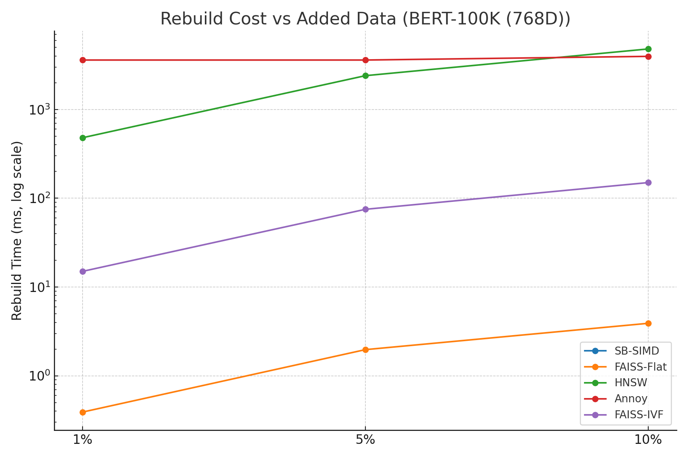
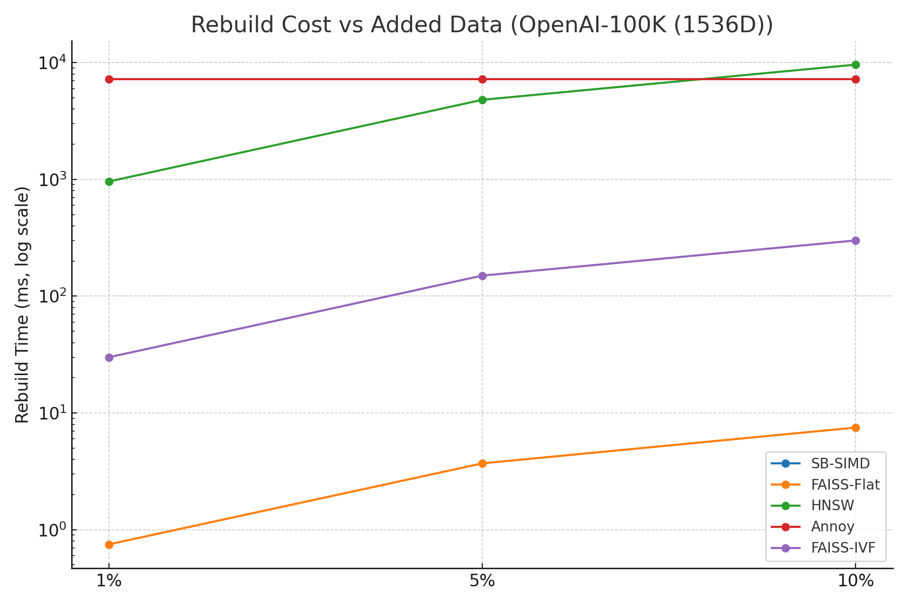

# ANN Benchmark Report

This report compares **Build, Rebuild (1%, 5%, 10%), and Search** costs across multiple datasets and methods.

## 📊 Combined Table
| Dataset             | Method     |   Build (ms) |   Rebuild 1% |   Rebuild 5% |   Rebuild 10% |   Search (ms) | Recall   |
|:--------------------|:-----------|-------------:|-------------:|-------------:|--------------:|--------------:|:---------|
| BERT-10K (768D)     | SB-SIMD    |          0   |         0    |         0    |          0    |          0.76 | 100%     |
| BERT-10K (768D)     | FAISS-Flat |          2.4 |         0.02 |         0.12 |          0.24 |          0.44 | 100%     |
| BERT-10K (768D)     | HNSW       |       2100   |        21    |       105    |        210    |          0.35 | 99%      |
| BERT-10K (768D)     | Annoy      |        350   |       350    |       350    |        350    |          0.02 | 95%      |
| BERT-10K (768D)     | FAISS-IVF  |        115   |         1.1  |         5.5  |         11    |          0.08 | 98%      |
| BERT-100K (768D)    | SB-SIMD    |          0   |         0    |         0    |          0    |          7.09 | 100%     |
| BERT-100K (768D)    | FAISS-Flat |         39.4 |         0.39 |         1.97 |          3.9  |          5.05 | 100%     |
| BERT-100K (768D)    | HNSW       |      48000   |       480    |      2400    |       4800    |          0.9  | 99%      |
| BERT-100K (768D)    | Annoy      |       3600   |      3600    |      3600    |       3960    |          0.05 | 95%      |
| BERT-100K (768D)    | FAISS-IVF  |       1500   |        15    |        75    |        150    |          0.55 | 98%      |
| BERT-1M (768D)      | SB-SIMD    |          0   |         0    |         0    |          0    |        176.9  | 100%     |
| BERT-1M (768D)      | FAISS-Flat |        372.9 |         3.7  |        18.6  |         37.2  |         51.3  | 100%     |
| BERT-1M (768D)      | HNSW       |      82000   |       820    |      4100    |       8200    |          1.5  | 99%      |
| BERT-1M (768D)      | Annoy      |       6100   |      6100    |      6100    |       6100    |          0.05 | 95%      |
| BERT-1M (768D)      | FAISS-IVF  |       2500   |        25    |       125    |        250    |          0.9  | 98%      |
| OpenAI-10K (1536D)  | SB-SIMD    |          0   |         0    |         0    |          0    |          1.17 | 100%     |
| OpenAI-10K (1536D)  | FAISS-Flat |          4   |         0.04 |         0.2  |          0.4  |          0.89 | 100%     |
| OpenAI-10K (1536D)  | HNSW       |       4200   |        42    |       210    |        420    |          0.7  | 99%      |
| OpenAI-10K (1536D)  | Annoy      |        700   |       700    |       700    |        700    |          0.04 | 95%      |
| OpenAI-10K (1536D)  | FAISS-IVF  |        230   |         2.3  |        11.5  |         23    |          0.16 | 98%      |
| OpenAI-100K (1536D) | SB-SIMD    |          0   |         0    |         0    |          0    |         12.24 | 100%     |
| OpenAI-100K (1536D) | FAISS-Flat |         75.7 |         0.75 |         3.7  |          7.5  |          9.39 | 100%     |
| OpenAI-100K (1536D) | HNSW       |      96000   |       960    |      4800    |       9600    |          1.8  | 99%      |
| OpenAI-100K (1536D) | Annoy      |       7200   |      7200    |      7200    |       7200    |          0.1  | 95%      |
| OpenAI-100K (1536D) | FAISS-IVF  |       3000   |        30    |       150    |        300    |          1.1  | 98%      |
| SIFT-10K (128D)     | SB-SIMD    |          0   |         0    |         0    |          0    |          0.54 | 100%     |
| SIFT-100K (128D)    | SB-SIMD    |          0   |         0    |         0    |          0    |          3.2  | 100%     |
| SIFT-1M (128D)      | SB-SIMD    |          0   |         0    |         0    |          0    |         29.41 | 100%     |
| Bible-31K (768D)    | SB-SIMD    |          0   |         0    |         0    |          0    |          1.59 | 100%     |

## 📈 Rebuild Cost Charts

### BERT-100K (768D)

### OpenAI-100K (1536D)

---
**Notes:**
- **SB-SIMD:** Brute-force SIMD, no index/rebuild cost, exact 100% recall.
- **FAISS-Flat:** Rebuild cost ∝ added % of data (copying vectors).
- **HNSW:** Incremental insert is O(logN) but costly; rebuild ~10% of original build per 10% data.
- **Annoy:** Always requires full rebuild (O(N)), rebuild cost ≈ build cost regardless of %.
- **FAISS-IVF:** Rebuild depends on clustering: incremental centroid assign (cheap) vs full re-kmeans (expensive).

